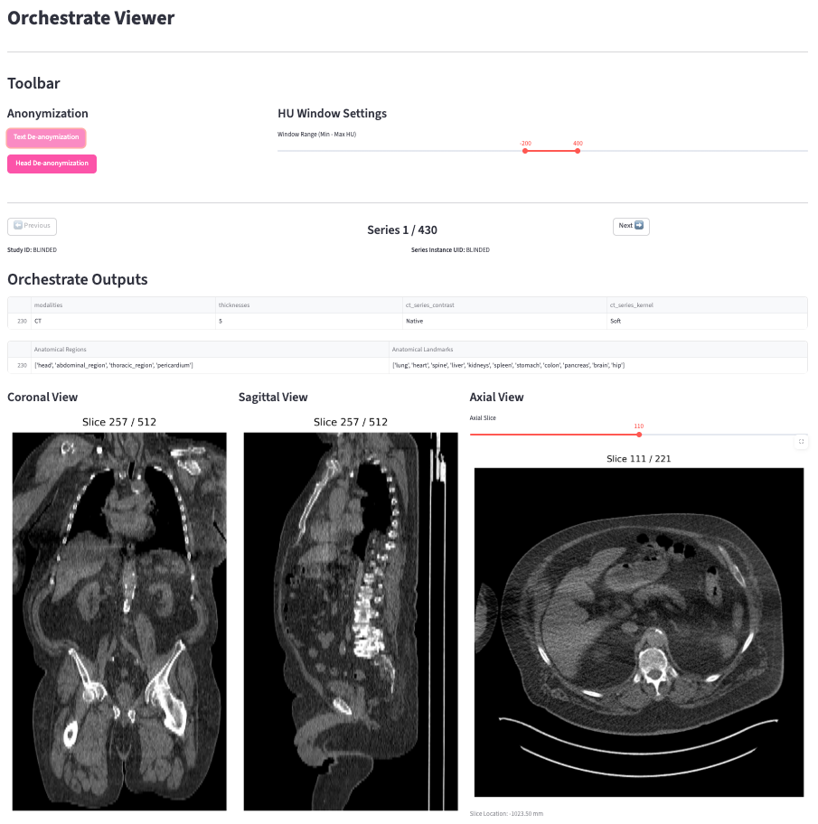

# Orchestrate
[](https://opensource.org/licenses/MIT)
[](https://pypi.org/project/ultralytics/)
[](https://www.python.org/downloads/release/python-31011/)
[](https://pypi.org/project/ultralytics/)

---
## Installation

```bash
git clone https://github.com/UMEssen/Orchestrate.git
cd Orchestrate
poetry install
```

---
## Dashboard
### Run
```bash
cd dashboard
streamlit run app_advance.py
```

